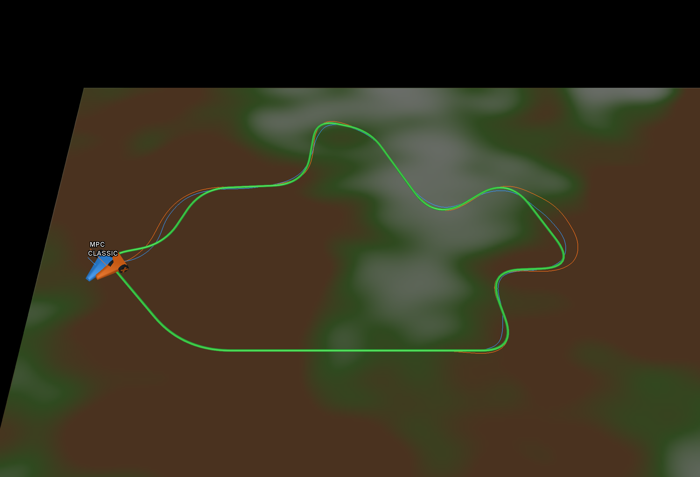

# Autonomous Controller Comparison



Compare classic control and model predictive control (MPC) on DeepMind's MuJoCo
car, or drive manually along a random green closed-loop reference. The car uses
differential drive, with two driven wheels and a front support.

Use Python 3.14+ and `uv`. The viewer needs a desktop display. `uv sync` installs
the simulation and MPC dependencies from `uv.lock`.

```sh
uv sync
uv run sim
uv run sim --mode manual --friction random
uv run sim --mode classic --friction medium
uv run sim --mode mpc --friction high
uv run sim --mode compare --friction random
uv run sim --help
```

The default is `--mode manual --friction high`. Use `--help` for all options.

| `--mode` | Behavior |
| --- | --- |
| `manual` | Keyboard driving |
| `classic` | Variable-speed path following with LOS guidance and heading PD |
| `mpc` | Predictive speed and turning control using [do-mpc](https://www.do-mpc.com/en/latest/) |
| `compare` | Blue **CLASSIC** and orange **MPC** cars, each labeled |

Comparison cars start together and share the same track and friction map. They
have independent physics, so they can overlap without colliding. Both use the
same variable-speed reference at the same path position; their actual speeds
and controller limits can differ.

| `--friction` | Ground |
| --- | --- |
| `high` | Grey concrete; uniform friction 1.0 (default) |
| `medium` | Green grass; uniform friction 0.3 |
| `low` | Brown mud; uniform friction 0.08 |
| `random` | Smooth friction map between 0.03 and 1.0, blending the same ground colors |

In manual mode, hold **W/S** (or up/down) to drive and **A/D** (or left/right)
to turn. Releasing the keys switches off motor effort; it does not brake.
**R** resets all cars and controllers, clears their trails, and generates a new
loop. Uniform friction stays unchanged; random mode generates a new shared map.
**Esc** closes the window.

Thin, translucent trails match each car's color and retain its latest 3,000
position samples. They trace the body-origin `(x, y)` used for path tracking,
projected onto the reference line's ground plane. Perfect tracking therefore
overlaps the reference; there is no offset to the rear of the car.

Random grip combines Gaussian-smoothed noise at two scales, creating broad
regions with smaller irregular variations. The map stays fixed until reset.
Each driven wheel samples it continuously using bilinear interpolation at its
position, with friction updated every 2 ms physics step. The ground is one flat
collider; the texture displays the same map.

Both autonomous controllers use the same callable interface. For example,
[`ClassicController`](src/simple_robot_comparison/controllers/classic/classic_control.py):

```python
from simple_robot_comparison.controllers.classic.classic_control import (
    ClassicController,
)

controller = ClassicController()
control_input = controller(observation, reference, dt)
```

The controller is called every 0.02 simulation seconds. `observation` contains
world position, heading, velocities, and wheel speeds; `reference` contains ordered `(x, y)`
points in metres forming a closed loop. `dt` is the timestep in seconds.
Observations are ideal simulated state and exclude terrain friction.

Return `ControlInput(forward=..., turn=...)`, with both motor efforts in `[-1, 1]`:
positive `forward` drives ahead and positive `turn` turns left.
Controllers retain their state between calls; **R** creates fresh instances.
Add each future method in its own file and register
a factory that creates its controller
in [`CONTROLLERS`](src/simple_robot_comparison/controllers/__init__.py) to expose
it through `--mode`. For a stateless function, the factory can be `lambda: control`.

- `main.py`: CLI options and the short control loop.
- `controllers/`: controllers and factories for their mode names.
- `controllers/speed_reference.py`: shared curvature and braking speed profile.
- `controllers/mpc/mpc_control.py`: MPC configuration, prediction model, and feedback.
- `observation.py`: controller inputs and their units.
- `control_input.py`: named forward and turn motor efforts.
- `simulation.py`: load, reset, and step the compiled MuJoCo physics.
- `reference.py`: generate a smooth closed loop in metres.
- `terrain.py`: create flat ground and a continuous friction map.
- `viewer.py`: keyboard input and MuJoCo rendering.
- `models/car.xml`: the car model.

The reference has no collision geometry; stay on the finite ground area.
Slip emerges from contact physics; this is not a deformable-mud model.
The simulation can run without the viewer for future RL.

Car adapted from [Google DeepMind's example](https://github.com/google-deepmind/mujoco/blob/main/model/car/car.xml)
under Apache-2.0; see `src/simple_robot_comparison/models/LICENSE`.

## Autonomous Systems

### Classic control

A simple path-following controller for a stable differential-drive rover: LOS selects the desired heading, and PD determines the turning rate.

#### Select a lookahead target

Find the closest point on the path to the rover. From that point, move a fixed distance $L$ forward **along the path** to obtain the target $(x_m,y_m)$.

For a waypoint path, project onto the closest segment, accumulate segment lengths,
and interpolate where you reach $L$. Closed circuits wrap across the start line;
an open path uses its endpoint. Larger $L$ gives gentler corrections; smaller $L$
gives sharper corrections.

#### Calculate the turning command

Given rover position $(x,y)$ and heading $\theta$:

$$
\theta_{\mathrm{ref}}=\operatorname{atan2}(y_m-y,\;x_m-x)
$$

$$
e_k=\operatorname{wrap}(\theta_{\mathrm{ref}}-\theta),
\qquad
\dot e_k\approx\frac{\operatorname{wrap}(e_k-e_{k-1})}{\Delta t}
$$

$$
\omega_{\mathrm{cmd}}
=\operatorname{clip}(K_p e_k+K_d\dot e_k,\;-\omega_{\max},\;\omega_{\max})
$$

`wrap` maps angles to $[-\pi,\pi)$. Angles use radians; the implementation filters
the derivative with a 0.1 s time constant.

#### Calculate the forward-speed reference

Both classic and MPC use
[`controllers/speed_reference.py`](src/simple_robot_comparison/controllers/speed_reference.py)
to plan faster travel on straights and slower travel in tight turns.
`build_speed_profile(...)` builds the profile; classic's `speed_reference(...)`
samples it at the current position. Each controller stores its current reference
in `self.speed_reference`.

Estimate the magnitude of curvature from the circle through three neighbouring
waypoints. With incoming vector $a$ and outgoing vector $b$:

$$
|\kappa_i|=\frac{2|a_xb_y-a_yb_x|}{\|a\|\,\|b\|\,\|a+b\|}
$$

Curvature has units $\mathrm{m}^{-1}$ and is zero on a straight. Since lateral
acceleration is $a_{\mathrm{lat}}=v^2|\kappa|$, the initial speed limit is

$$
v_i=\min\left(v_{\max},
\sqrt{\frac{a_{\mathrm{lat,max}}}{\max(|\kappa_i|,\epsilon)}}\right).
$$

The profile also respects the nominal yaw-rate and wheel-speed limits:

$$
v_i\leq\frac{\omega_{\max}}{\max(|\kappa_i|,\epsilon)},
\qquad
v_i\leq\frac{r\dot\phi_{\max}}{1+\frac b2|\kappa_i|}.
$$

The second limit leaves room for the outer wheel to turn faster in a corner.
To start braking **before** a turn, walk backwards along the path and apply

$$
v_i^2\leftarrow\min\left(v_i^2,
v_{i+1}^2+2a_{\mathrm{brake,max}}\Delta s_i\right).
$$

This follows from $v_{i+1}^2=v_i^2-2a_{\mathrm{brake,max}}\Delta s_i$ under
constant deceleration. Two backwards passes handle the closed-loop seam, so a
corner just after start/finish also slows the approach before it. Interpolate
$v^2$ at the car's closest projection onto the path, then take the square root
to obtain $v_{\mathrm{ref}}$. The existing wheel-reference rate limit controls
acceleration towards this target.

Tune the shared profile with these flags in `classic`, `mpc`, or `compare` mode:

| Flag | Default | Meaning |
| --- | --- | --- |
| `--max-speed` | `0.5` | Maximum reference speed in m/s |
| `--max-lateral-acceleration` | `0.3` | Planned cornering acceleration limit in m/s² |
| `--max-braking-acceleration` | `0.25` | Planned braking acceleration in m/s² |

`--mpc-speed` remains an alias for `--max-speed` and affects both cars in compare
mode. MPC and compare require a speed cap no higher than 0.5 m/s.

The profile uses nominal assumptions and excludes the hidden friction map.
It does not guarantee minimum lap time, grip adaptation, or actual acceleration
limits. Wheel-speed feedback controls wheel rotation, so body speed can differ
from the reference when slipping.

#### Calculate wheel-speed references

Use the varying forward-speed reference $v_{\mathrm{ref}}$ calculated above.
For wheel radius $r$ and wheel separation $b$:

$$
\dot\phi_{R,\mathrm{ref}}
=\frac{v_{\mathrm{ref}}+\frac b2\omega_{\mathrm{cmd}}}{r},
\qquad
\dot\phi_{L,\mathrm{ref}}
=\frac{v_{\mathrm{ref}}-\frac b2\omega_{\mathrm{cmd}}}{r}
$$

Positive wheel speeds mean forward motion; positive $\omega$ means counterclockwise rotation.

#### Convert wheel speeds to motor effort

MuJoCo's motors take effort commands. A proportional wheel-speed feedback loop
uses simulated encoder readings, with feedforward compensation for the model's
viscous joint damping:

$$
\tau_i = \operatorname{clip}\left(d\dot\phi_{i,\mathrm{ref}}
  + K_v(\dot\phi_{i,\mathrm{ref}}-\dot\phi_i),\;-\tau_{\max},\;\tau_{\max}\right)
$$

The car's tendon gearing gives $\tau_L=(u_{\mathrm{forward}}-u_{\mathrm{turn}})/2$
and $\tau_R=(u_{\mathrm{forward}}+u_{\mathrm{turn}})/2$, so the controller returns
`ControlInput(forward=tau_left + tau_right, turn=tau_right - tau_left)`.

Classic currently uses lookahead **0.1 m**, turn-rate references limited to
**10 rad/s**, wheel-speed references to **30 rad/s**, and their rate of change to
**15 rad/s²**. Its controller torque clip is **1 N m**. The simulation then clips
each control input to `[-1, 1]`, and MuJoCo limits each wheel's total actuator
torque to **0.5 N m**. These are simulation settings; MuJoCo determines actual
acceleration and slip.

### MPC control

[`controllers/mpc/mpc_control.py`](src/simple_robot_comparison/controllers/mpc/mpc_control.py)
implements `MPCController` with do-mpc, CasADi, and the IPOPT nonlinear solver.
It plans forward speed and turning rate, then uses wheel-speed feedback to
produce motor efforts.

The default horizon is **15 steps × 0.1 s = 1.5 s**. Every 0.1 simulation seconds,
the controller predicts motion, minimizes tracking error subject to command
limits, and takes the first command. It replans from the newly observed pose
after that interval. Wheel references ramp toward the selected command and
motor feedback runs every **0.02 s** between solves.

#### Prediction model and future targets

`_build_mpc()` defines five states: body position `(x, y)`, heading `theta`, and
the current **commanded** forward speed and yaw rate. The two optimized inputs
are the speed and yaw rate to reach by the next prediction step. Commanded
motion is reconstructed from `wheel_reference`; measured pose updates the
prediction, while measured wheel speeds feed the motor controller.

The nominal rolling model accounts for the body origin being $l=0.07$ m ahead
of the wheel axle:

$$
\dot x=v\cos\theta-l\omega\sin\theta,\qquad
\dot y=v\sin\theta+l\omega\cos\theta,\qquad
\dot\theta=\omega.
$$

The discrete update uses midpoint integration of a linear speed/yaw-rate ramp.
`model.set_rhs("pose", ...)` defines the next pose, and
`model.set_rhs("motion", command)` makes the next commanded motion equal the
selected input.

`reference_horizon()` projects the car onto the path and samples future
`(x, y, heading, speed)` targets from the shared speed profile. It advances path
distance using $ds/dt=v_{\mathrm{ref}}(s)$, so slower bends have closer-spaced
targets. Closed paths wrap across the finish. Open paths hold the last point
with zero target speed once future samples reach it.

#### Objective, constraints, and motor feedback

For position errors $e_x,e_y$, heading error $e_\theta$, and commanded-speed
error $e_v$, the per-state tracking cost is

$$
L=q_p(e_x^2+e_y^2)+2q_\theta(1-\cos e_\theta)+q_v e_v^2.
$$

`set_objective(lterm=cost, mterm=cost)` applies it along the horizon and at the
final state. The periodic heading term handles angle wraparound.
`set_rterm(command=...)` adds a penalty on changes in speed and turning commands
to encourage smooth control. Tracking targets are weighted preferences.

Hard command constraints enforce forward speed in `[0, max_speed]`, bounded yaw
rate, and bounded wheel speeds and accelerations. MPC's nominal wheel-speed
limit is $0.5/0.03\approx16.67$ rad/s, from the model's torque limit and damping.
The default acceleration limit permits at most a 1.5 rad/s wheel-reference
change per 0.1 s interval. The shared lateral-acceleration setting shapes the
reference; it is not a hard constraint on the optimized trajectory.

In `__call__()`, `self._mpc.make_step(state)` solves the problem and returns the
first speed/turn command. The controller converts it to wheel speeds, ramps
the references, and uses the damping compensation and wheel-speed feedback
described above, with a **0.5 N m** torque clip. Solver failures raise an error
and stop the run. IPOPT seeks a local solution; global optimality is not assured.

The prediction assumes rolling without slip and ideal wheel-speed tracking.
It has no friction estimator or grip preview. MuJoCo simulates the actual
contacts and slip, so replanning can correct observed errors but cannot guarantee
the predicted motion on slippery ground.

#### MPC tuning

These flags affect `mpc` and the MPC car in `compare`. Defaults are in `MPCConfig`.

| Flag | Default | Meaning |
| --- | --- | --- |
| `--mpc-horizon` | `15` | Number of prediction intervals |
| `--mpc-time-step` | `0.1` | Prediction interval and time between solves, in seconds |
| `--mpc-max-yaw-rate` | `4.0` | Commanded turning-rate limit in rad/s |
| `--mpc-wheel-acceleration` | `15.0` | Wheel-reference acceleration limit in rad/s² |
| `--mpc-position-weight` | `30.0` | Position-error penalty |
| `--mpc-heading-weight` | `1.0` | Heading-error penalty |
| `--mpc-speed-weight` | `5.0` | Commanded-speed tracking penalty |
| `--mpc-input-weight` | `0.1` | Penalty on command changes |

All values must be finite and positive; the horizon must be an integer and the
time step a positive multiple of 0.02 s. Increasing the horizon extends preview
and increases computation. Changing the time step changes both solve frequency
and preview duration. Timing is in simulation seconds; computation and rendering
can make a run slower than real time.

```sh
uv run sim --mode compare --friction random --max-speed 0.4 --mpc-horizon 20
uv run sim --mode mpc --mpc-time-step 0.04 --mpc-horizon 30
```

Comparison shares the path, terrain, starting state, and speed profile, but the
controllers' internal limits differ: classic uses 30 rad/s wheel and 10 rad/s
yaw references, versus MPC's 16.67 rad/s and 4 rad/s defaults. Their torque clips
also differ as described above. These choices affect results alongside the
control methods; shared reference speeds do not imply identical actual speeds.

## Development checks

```sh
uv run python -m unittest discover -s tests -v
uv run ruff check .
uv run ruff format --check .
```
